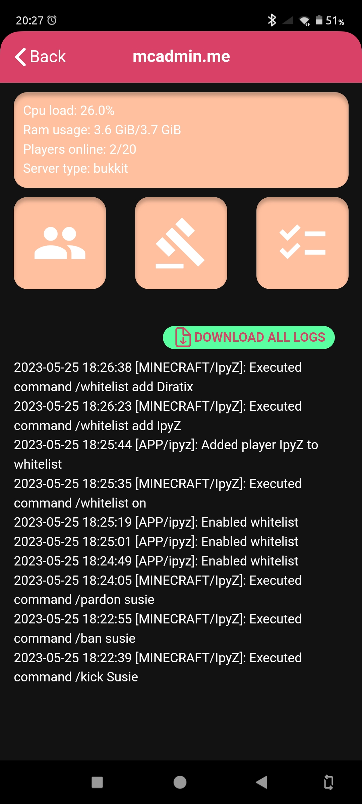
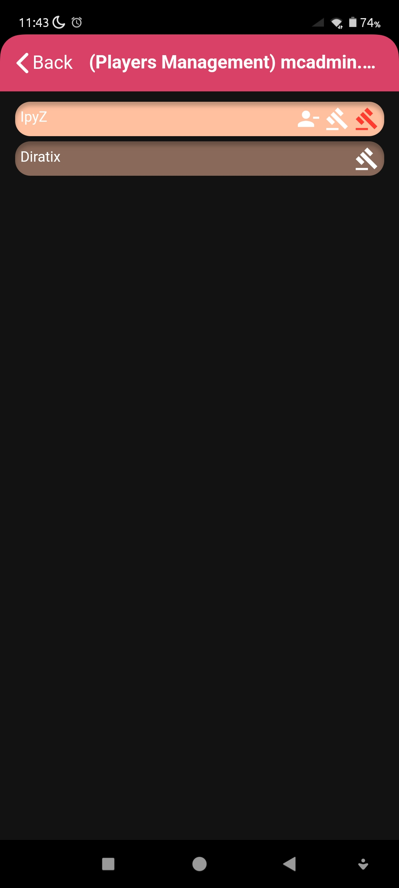
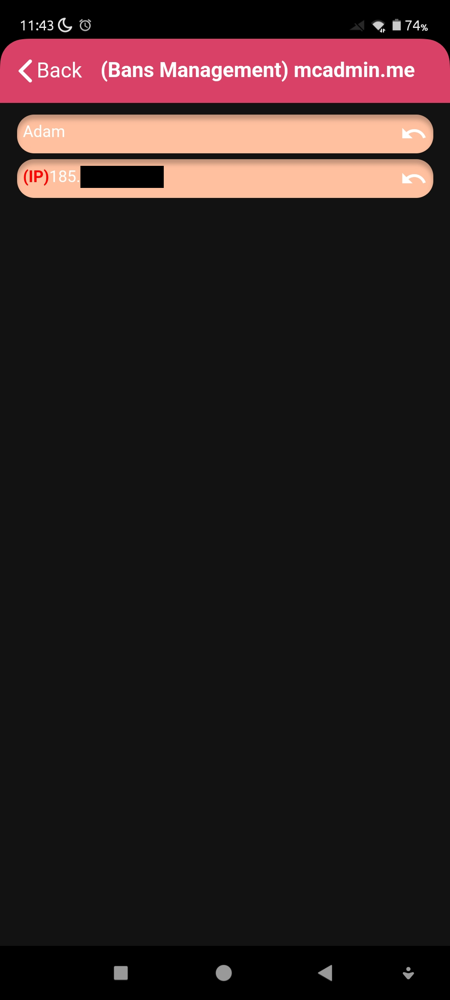
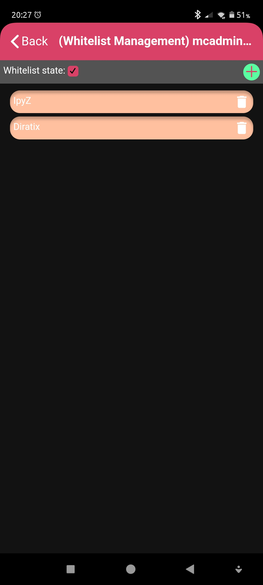

<h1 align="center">
  
</h1>

  MCAdmin-Toolkit
   
  <a href="#about"><strong>Explore the screenshots »</strong></a>
   
   
  <a href="https://github.com/MCAdmin-Toolkit-dev-team/MCAdmin-Toolkit/issues/new?assignees=&labels=bug&template=01_BUG_REPORT.md&title=bug%3A+">Report a Bug</a>
  ·
  <a href="https://github.com/MCAdmin-Toolkit-dev-team/MCAdmin-Toolkit/issues/new?assignees=&labels=enhancement&template=02_FEATURE_REQUEST.md&title=feat%3A+">Request a Feature</a>
  .
  <a href="https://github.com/MCAdmin-Toolkit-dev-team/MCAdmin-Toolkit/issues/new?assignees=&labels=question&template=04_SUPPORT_QUESTION.md&title=support%3A+">Ask a Question</a>

 

---

## About

> MCAdmin-Toolkit is a complete system that allows you to manage players on your Minecraft server from a mobile phone.  
> All you have to do is install our Minecraft bukkit plugin, add ssl certs to it, provide server credentials to this app and you are good to go!  
> Features that our project contain are:
> 1. Current server status report (CPU usage, RAM usage and players online)
> 2. Live logs preview
> 3. Logs dump to file
> 4. Kicking
> 5. Baning
> 6. IP-Banning
> 7. Unbanning
> 8. IP-Unbanning
> 9. Whitelist on/off
> 10. Whitelist add or remove player
> 11. Listing online and offline players, banned players and whitelisted players.
> 
> All from this app.
> Bukkit plugin repo: [https://github.com/MCAdmin-Toolkit-dev-team/MCAdmin-Toolkit-plugin](https://github.com/MCAdmin-Toolkit-dev-team/MCAdmin-Toolkit-plugin)

Screenshots

 

|                             Home Screen                                       |                    Login Screen                                                 |                                         Server dashboard                                |                      Players management                                                           |                 Bans management                                     |             Whitelist management                                         |
| :-------------------------------------------------------------------:         | :--------------------------------------------------------------------:          | :------------------------------------------------------------------------------:        | :-----------------------------------------------------------------------------------------------: | :-----------------------------------------------------------------: | :----------------------------------------------------------------------: |
|  |  |  |  |  |  |

### Built With

> To build this app, we used:
> - Framework7
> - ReactJS
> 
> Those were main tools/libraries that we used to crate this app.

## Getting Started

### Prerequisites

> First of all you have to setup our plugin. You can read about setup of it here: [https://github.com/MCAdmin-Toolkit-dev-team/MCAdmin-Toolkit-plugin](https://github.com/MCAdmin-Toolkit-dev-team/MCAdmin-Toolkit-plugin)
> Then allow your file manager to install apps and run the apk file

### Installation

> First download the app. You can do it here: [https://github.com/MCAdmin-Toolkit-dev-team/MCAdmin-Toolkit/releases](https://github.com/MCAdmin-Toolkit-dev-team/MCAdmin-Toolkit/releases)  
> Then allow your file manager to install apps and then run the apk file

## Usage

You can read about usage [here](docs/USAGE.md)

## Roadmap

We want to implement new things to our system. Here's what we plan for closest future:
- Configurable security levels
- Move from java-express to gRPC (or other technology)
- Implement in-app permission management based on Luckperms API

## Support

> Working on this

Reach out to the maintainer at one of the following places:

- Github:
  - [IpyZ](https://github.com/IpyZ)
  - [Diratix](https://github.com/Diratix)

- Discord:
  - Diratix#6897
  - IpyZ#0639
  - Still working on official discord server

## Contributing

First off, thanks for taking the time to contribute! Contributions are what make the open-source community such an amazing place to learn, inspire, and create. Any contributions you make will benefit everybody else and are **greatly appreciated**.

Please read [our contribution guidelines](docs/CONTRIBUTING.md), and thank you for being involved!

## Authors & contributors

The original setup of this repository is by:
- [IpyZ (Filip Śliwa)](https://github.com/IpyZ)
- [Diratix (Daniel Pawelec)](https://github.com/Diratix)

For a full list of all authors and contributors, see [the contributors page](https://github.com/MCAdmin-Toolkit-dev-team/MCAdmin-Toolkit/contributors).

## License

This project is licensed under the **GNU General Public License v3**.

See [LICENSE](LICENSE) for more information.

## About a readme
This readme was created with this template: [https://github.com/dec0dOS/amazing-github-template#readme](https://github.com/dec0dOS/amazing-github-template#readme)
