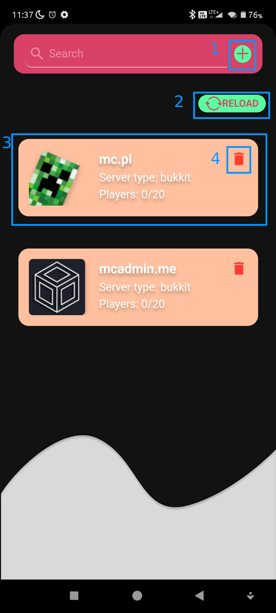
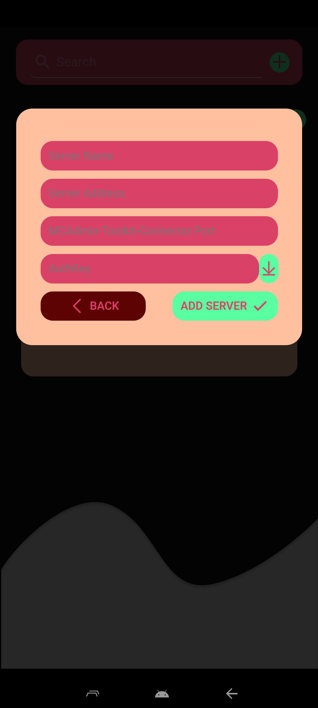
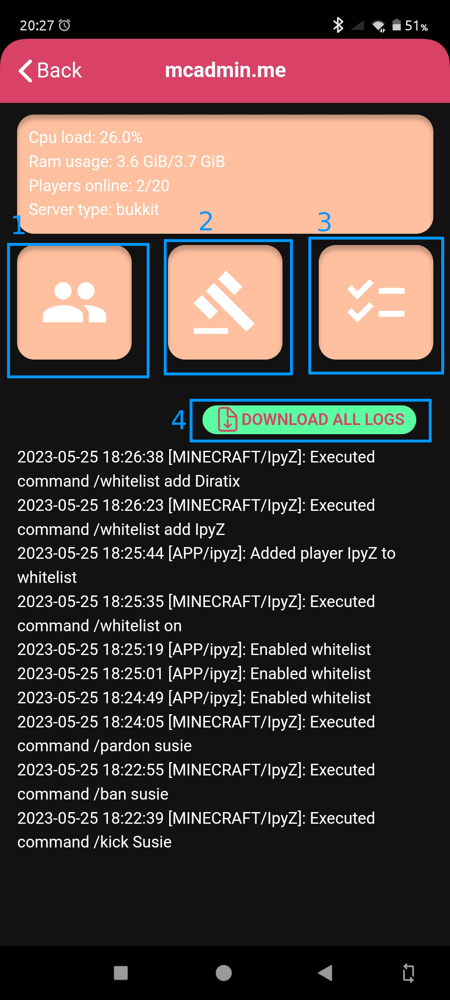
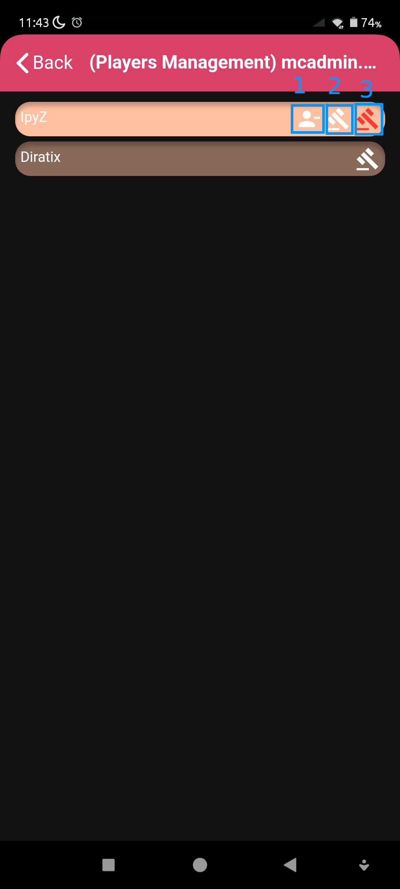
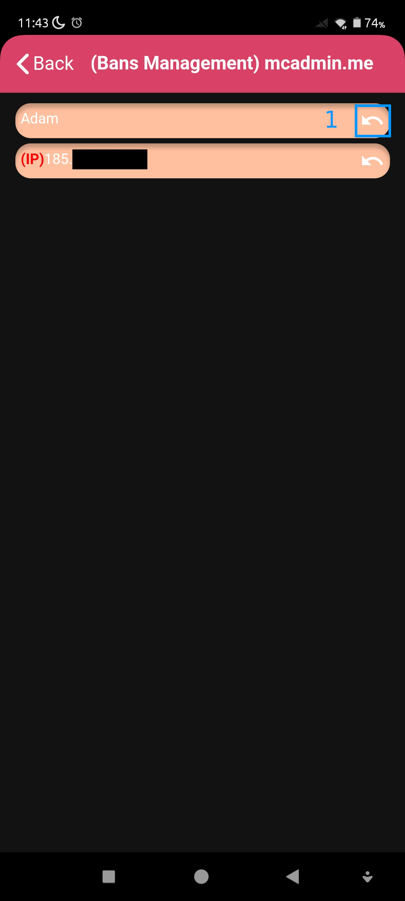
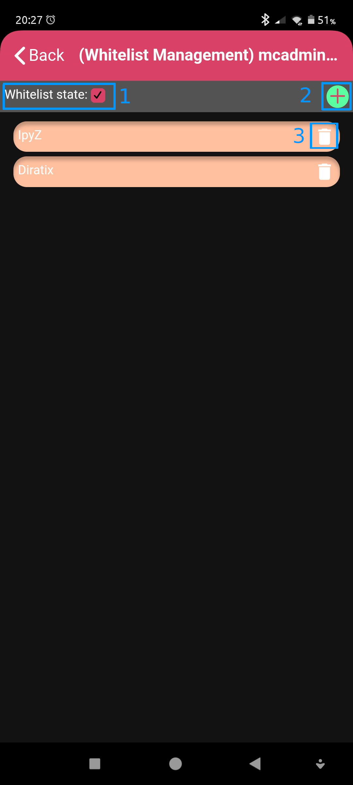

# Usage

## Home screen

> 1. Add new server
> 2. Reload server list
> 3. Go to this server dashboard
> 4. Remove the server

## Adding new server popup

> - Server name - friendly name of server, you can type here whatever you want
> - Server address - ip address or domain with port that is location of your server
> - MCAdmin-Toolkit-Connector Port: port on which our plugin works
> - AuthKey: authorization key
> - Download button - downloads auth key, based on download key. You can read more about download key [here](#download-key)

## Server dashboard

> 1. Players management screen
> 2. Bans management screen
> 3. Whitelist management screen
> 4. Gives you a share button with file that contains all logs

## Players management

> 1. Kick player. You have to provide a reason
> 2. Ban player, you have to provide a reason and amount of time for ban
> 3. IP-Ban, you have to provide a reason

## Bans management

> 1. Unban player

## Whitelist management

> 1. Enable or disable whitelist
> 2. Add player to whitelis, by providing the nick (right now not working well with players that have pirated game)
> 3. Remove the player from the whitelist

## Download key

> Download key is a 5 characters long key, that allows you to easly download auth key from server. It is created when new auth key were created, and is displayed only for person who created that auth key. It lives for 5 minutes and **THERE CAN BE ONLY ONE DOWNLOAD KEY AT THE SAME TIME**. If someone add new authkey while download key for previous still exists, **PREVIOUS DOWNLOAD KEY WILL BE REPLACED WITH THE NEW ONE**